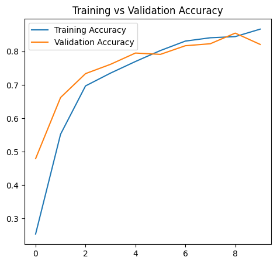
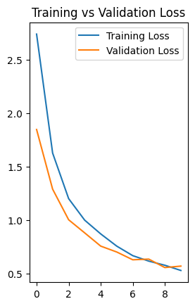
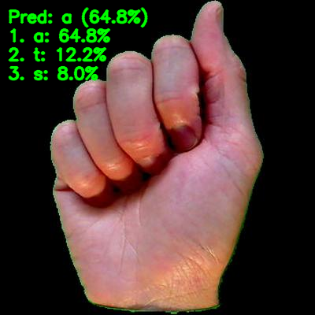

# ASL Vision

ASL Vision is a computer vision portfolio project for classifying ASL letters and digits (`A-Z`, `0-9`) using TensorFlow + MobileNetV2, with both static image inference and real-time webcam inference.



## Architecture Overview
- `src/data_loader.py`: dataset loading + augmentation
- `src/train.py`: model build/compile/train/save
- `src/evaluate.py`: deterministic evaluation + artifact export
- `src/inference.py`: reusable frame/image inference helpers
- `src/webcam_inference.py`: webcam loop with overlays and graceful errors
- `src/system_check.py`: environment/runtime checks
- `run_train.py`: train + evaluate + optional artifact export
- `run_webcam.py`: real-time webcam inference entrypoint

## Model Overview
- Backbone: `MobileNetV2` (`imagenet` weights, transfer learning)
- Input: `224x224x3`
- Classes: `36` total (`0-9`, `a-z`)
- Loss: `sparse_categorical_crossentropy`
- Optimizer: `Adam`
- Preprocessing: `mobilenet_v2.preprocess_input` (inside model graph)

## Results
- Validation accuracy: ~`85%` (v1 baseline)
- Deterministic evaluation pipeline (batch-aligned labels/predictions)




## Demo
### Static Inference
Run single-image prediction:

```bash
python -m src.test_inference --image path/to/image.jpg --model-path models/asl_mobilenetv2.keras --class-names models/class_names.json
```

Example artifact:



### Webcam Inference
Run real-time inference:

```bash
python run_webcam.py --model-path models/asl_mobilenetv2.keras --class-names models/class_names.json --camera-index 0
```

Expected behavior:
- live top prediction + confidence overlay
- top-k predictions
- optional FPS display
- press `q` to quit

## Setup
```bash
pip install -r requirements.txt
```

Dataset path expected by default:

```text
data/raw/asl_dataset/
```

Quick runtime check:

```bash
python -c "from src.system_check import run_system_check; run_system_check()"
```

## Training
Train and evaluate:

```bash
python run_train.py --epochs 10
```

Export artifacts (confusion matrix/report/training curves) to `assets/images/`:

```bash
python run_train.py --epochs 10 --save-artifacts
```

## Troubleshooting (macOS Webcam)
If webcam window fails or does not render:
1. Grant camera access to Terminal/VS Code in macOS Privacy settings.
2. Close other apps that may lock the webcam.
3. Try another index: `--camera-index 1`.
4. Run from a local GUI session (not remote/headless terminal).

## Notebooks
- `notebooks/03_model_training.ipynb`: training walkthrough and visual analysis
- `notebooks/05_webcam_inference.ipynb`: lightweight webcam run notes

## Roadmap (Post-v1)
- fine-tuning stage (partial unfreeze)
- improved hand ROI extraction for webcam robustness
- additional dataset balancing and error analysis

## Scope Notes
This v1 project is **character-level image classification**.
It does **not** perform word-level ASL translation, temporal sequence modeling, or sentence understanding.
